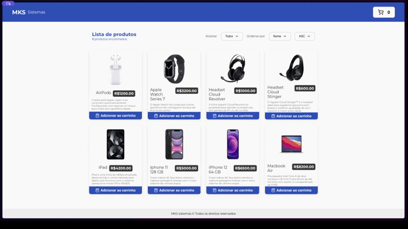

# mks-online-store-challenge

  

Este projeto é uma resposta ao desafio proposto pela MKS. O objetivo principal é demonstrar proficiência na elaboração de código claro, meticulosamente testado e reutilizável.

## Sobre o Projeto

O projeto consiste em uma aplicação de loja online que consome a [API REST de produtos](https://mks-frontend-challenge-04811e8151e6.herokuapp.com/api-docs/) da MKS para exibir uma lista de produtos. A aplicação contém uma única página/rota e um carrinho de compras.

- **Loja**: A lista de produtos é buscada da API da MKS. Cada produto contém um botão de adicionar ao carrinho, que adiciona o produto ao carrinho de compras.
- **Carrinho**: O carrinho contém todos os produtos selecionados, com a opção de aumentar a quantidade de cada produto selecionado, diminuir a quantidade ou remover o produto do carrinho.

Os testes unitários foram realizados com Jest e a testing-library.

## Ferramentas Utilizadas

1. TypeScript
2. Next.js
3. React-query
4. Styled-components
5. Framer-motion
6. Jest

## Desenvolvimento e Deploy

O projeto foi desenvolvido utilizando as ferramentas listadas acima, além de outras tecnologias que foram consideradas pertinentes para o desenvolvimento. 

Este projeto foi desenvolvido como parte do desafio proposto pela MKS e é um exemplo de como implementar um carrinho de compras utilizando os dados da API  para buscar os itens existentes e controlar o número de itens que o usuário deseja comprar.

[Link do desafio](https://github.com/MKS-desenvolvimento-de-sistemas/mks-frontend-challenge?tab=readme-ov-file)